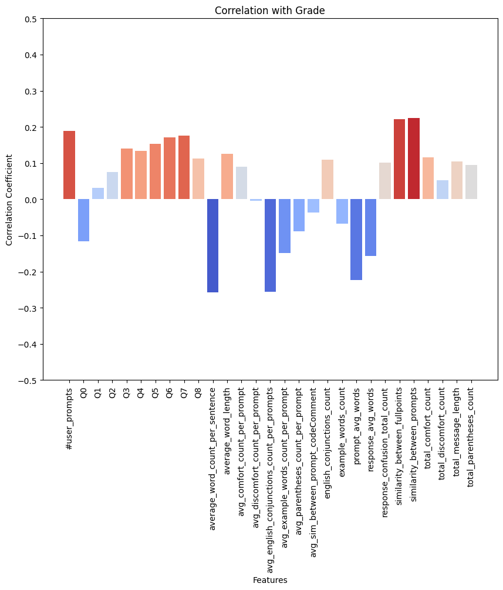
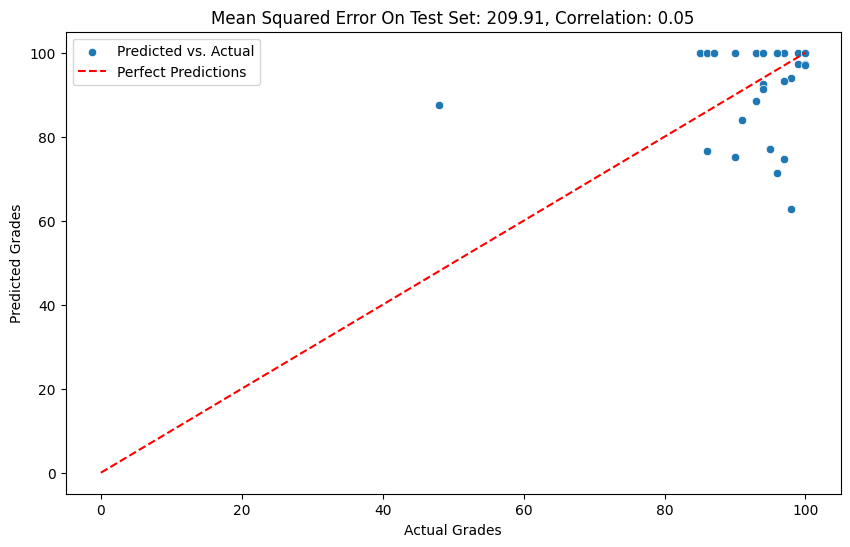
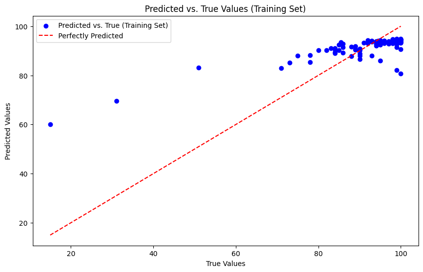
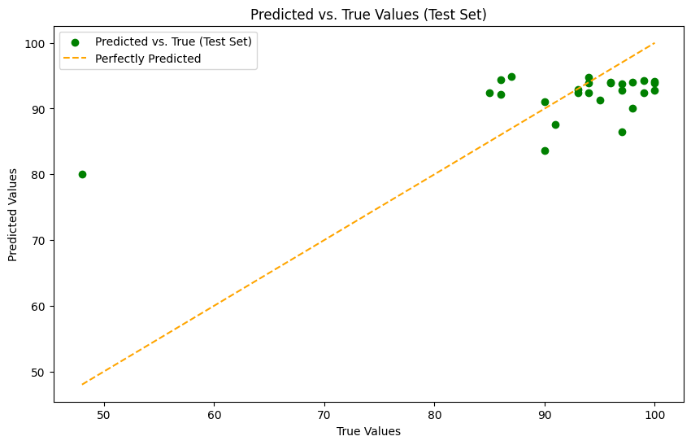

# Machine Learning Course (CS412) Project

In this project, we developed a machine learning model to predict the scores obtained in the first homework in the course by looking at the chatgpt histories of the students.

## Table Of Contents
+ ### [1.Dictionary](#dictionary)
+ ### [2.Prompt Matching](#prompt)
+ ### [3.Feature Engineering](#features)
- ### [4.Finalizing The Dataframe](#dataframe)
- ### [5.Modeling](#models)

## Chapter 1 - Code2convos Dictionary: Dividing Text Bodies Into Parts <a name="dictionary">

First thing we did was to divide the ChatGPT response into subtexts, which are text, code and commentCode. We believed that treating the responses as a whole would not serve our needs and also for deriving more features related the code examples provided by ChatGPT, this division helped a lot.

## Chapter 2 - Prompt Matching <a name="prompt">

Initially, we omitted some parts in the questions such as points indicator for the corresponding question in order for our similarity calculations to work better.

Then, we used the sentence_transformers library to load a pre-trained model for generating sentence embeddings to calculate the similarity between texts based on this library.

We created a dictionary such that each key is a HTML file names and their corresponding values are list of lists, where inner lists indicate each prompt in a given HTML file name, and 9 values inside the inner lists represent their similarity to 9 questions we have.

By using this dictionary called "result_dict", we had 3 different approaches in our mind:

####  result_dict format
#### {
    "html_file_1": [[0.1,0.2,0.1,0.1,0.1,0.1,0.1,0.1,0.1],[0.4,0.9,0.3,0.1,0.1,0.1,0.1,0.1,0.1]], 
    "html_file_2": [[0.1,0.2,0.1,0.1,0.1,0.1,0.1,0.1,0.1]]
#### }

Approach 1 (SELECTED):  Among all prompts in a given HTML file, we take the maximum similarity for a given question to assign a similarity score for a single file.
We think that it is the one that makes sense perfectly because let's say there is a prompt in the HTML file matching perfectly with the first question. At the same time, this means that HTML file should also be associated with the first question as well

Approach 2 : Among all prompts in a given HTML file, we take the average of the similarity values to assign a similarity score for a single file.
This does not seem feasible since the ones that are not related to the given question, decrease the similarity value significantly for a given HTML file.

## Chapter 3 - Feature Engineering <a name="features">

#### We focused on the occurences of the words related to the below metrics.

### Discomfort Metric
We identify several words indicating that the user is not comfortable with the response given by ChatGPT. These words are from the language itself such as "not correct" and from the Python error list such as "ValueError". We put the number of occurences of these words as a feature.

### Comfort Metric
We identify several words indicating that the user is comfortable with the response given by ChatGPT. These words are from the language itself such as "well done", "thank you". We put the number of occurences of these words as a feature.

### ChatGPT Confusion Metric
We observed that ChatGPT is mostly using only some bunch of words when the user indicates their discomfort. These are words such as "apologize", "confusion". We put the number of occurences of these words as a feature.

#### Below metrics are based on similarities

### Similarity between user prompts in a single file

We used pre-defined Word2Vec model for text embeddings to answer the question of how similar the prompts are. This possesses great importance since the repeated prompts can be a good indicator of the fact that user is stuck at some point.

### Similarity between prompt and ChatGPT's code comment

Thanks to what we did at Chapter 1, we were able to focus on the similarities between user prompts and the ChatGPT's code examples' comment part. Since ChatGPT verbalizes what it does in the code by using comments right before the code, we believe that this can be used as how strong the relationship between what is asked and what is obtained. Then we take the average of these similarities which are between prompt and GPT's code comment, since we need to associate only one value for a single HTML file.

### Similarity between student and 100-graded student

This feature is added in order to measure how similar the student's work to the students who got 100 in their homework.
We obtained the average feature vector from the ones getting 100 points in the homework and apply cosine similarity for each student's feature vector and put it as a new metric

#### Metrics related to how detailed the work is.

### Average word count for user prompts and responses

The average word count used in user prompts and ChatGPT's responses obtained for a given file.

### Total prompt length (as char length) & Average word length (as char length) per user prompt & Average word count per sentence in the user prompt

### Total english conjunctions count

We believe that this will help us measure how much effective the student is in their messages during the conversation with ChatGPT. The example conjunctions are "and", "or", "but" etc.

### Total example words count

It is used as a measure of how much the student desires to see examples from ChatGPT. Number of occurences of words such as "illustrate", "example" can help us to quantify this.

### Total parentheses count

In our assumption, students are expected to make further clarification when they use parentheses. Therefore, we added the number of occurences of parentheses in prompts.

## Chapter 4 - Finalizing The Dataframe & Dealing With Broken Files <a name="dataframe">

Once we finalized our dataframe by including the score data and our seperate prompt matching data with our base dataframe on which the feature engineering is done, we were ready to deal with the HTML files that give 404 error.

As a data imputation, we identified these student's grade and put the mean value of the students whose grade is close to the student with broken file. For example, if the student with broken file gets 90, we focused on the ones that got points close to 90 and created an average feature vector of those and put these vector as a feature vector for that student.

Moreover, there was a student whose score could not be identified in the csv file given to us. Since we were unable to know the score, we simply omitted it from the overall dataset.

## Chapter 5 - Modeling <a name="models">

### 1- Neural Networks
To train the neural networks, a subset of features is selected based on their correlation value. The optimal correlation threshold for feature selection is determined to be 0.15. Following this, the data is partitioned into two parts: a training set and a test set. A simple neural network is established with four layers (two of them being hidden layers). The predicted scores by the neural network are clipped between 0 and 100 to adhere to the constraints. Afterward, the mean squared error is calculated, resulting in a value of 209.90. The scatterplot below illustrates how our neural network model predicts the scores.

### 2- Using Ensemble Techniques - (Random Forest x Gradient Boosting
After getting high MSE values from the neural network, we decided to apply some other techniques. In this part, after eliminating the features that have below the certain correlation coefficient threshold, we apply necessary scalings by analyzing the distributions for each feature. For example, if a feature has skewed distribution, we applied robust scaler.
After these changes, we started modeling by GradientBoosting alone. But still, the MSE are not so small, compared to our previous neural network model. Therefore, we decided to use ensembling in which we ensemble 2 different techniques which are GradientBoostingRegressor and RandomForestRegressor. Once we tuned the hyperparameters through GridSearchCV, we trained our regressors and ensembled them together.
The result we got is way lower than what we got in NN. So, we decided on this model and made the necessary visualizations as below.

The performance is as follows (it is also in the notebook):

#### Training Set Metrics for Ensemble Model:
MSE Train: 79.41
R2 Train: 0.51

#### Test Set Metrics for Ensemble Model:
MSE Test: 66.83
MAE Test: 5.53
R2 Test: 0.32

